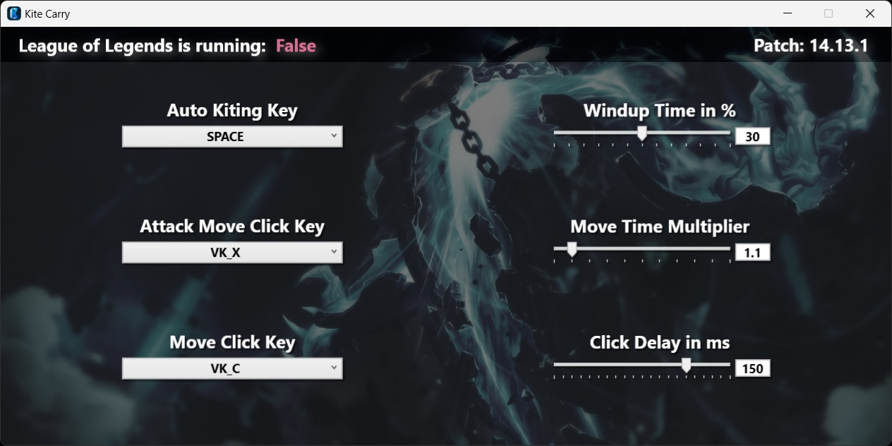

# Kite Carry

This project is a simple C# WPF application that interacts with the [League Client API](https://developer.riotgames.com/docs/lol#league-client-api)  
to perform perfect automatic kiting in the game League of Legends.  
This project is intended for educational purposes only and should be used responsibly.  
 
 

## Features

- Interacts with the [League Client API](https://developer.riotgames.com/docs/lol#league-client-api)
- Executes perfect automatic kiting
- Simple and intuitive WPF user interface

## Disclaimer

This project is not affiliated with or endorsed by Riot Games.  
The use of automation tools in online games is against the terms of service of most games  
and can result in bans or other penalties.
